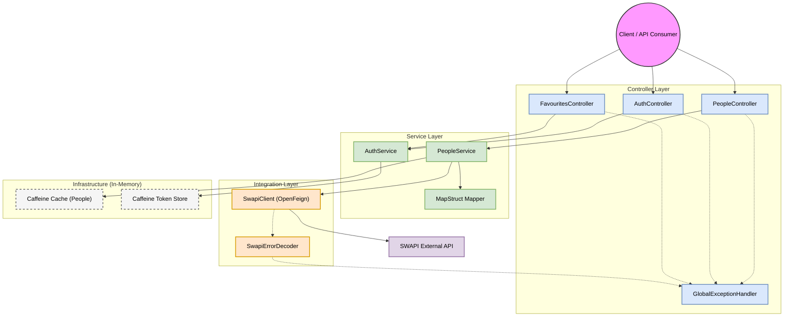

# Star Wars API Integration Service

A Spring Boot application that integrates with the public SWAPI (The Star Wars API).  
The project provides a REST API for retrieving Star Wars character information and implements a custom authentication
and authorization system.

## Tech Stack

Java 21  
Spring Boot 3.5.10 (Web, Cache, Validation, Actuator)  
Spring Cloud OpenFeign as a declarative HTTP client  
Caffeine as an in-memory caching library  
MapStruct for mapping between business entities and DTOs  
Lombok for reducing boilerplate code  
WireMock for integration testing

## Architecture and Design

The application follows a layered architecture consisting of Controller, Service, and Integration layers.



### Controllers

The API layer exposes three main REST endpoints.

People API (`/people`)  
Provides a paginated list of Star Wars characters and detailed information by character ID.

Auth API (`/auth`)  
Handles login, access token refresh, and logout operations.

Favourites API (`/favourites`)  
A protected resource available only to authenticated and authorized users.

### Integration and Error Handling

The integration with SWAPI is implemented using a Feign client.

A custom Feign error decoder translates integration-layer errors such as `404 Not Found` from SWAPI into domain-specific
exceptions like `NotFoundPersonException`.

A global exception handler centralizes handling of validation errors and business exceptions and returns a unified error
response format.

## Trade-offs and Design Decisions

### Authentication: Opaque Tokens vs JWT

The application uses opaque tokens based on UUID instead of stateless JWT.

This approach simplifies the implementation within limited time constraints and demonstrates stateful authentication
with caching.

Access and refresh tokens are generated as UUIDs and stored in application memory.  
This allows immediate token revocation on logout at the cost of a stateful service.

### Caching with Caffeine

Two caching approaches are used.

For the People API, declarative Spring Cache annotations are applied. Cache settings such as TTL and maximum size are
configured in `application.yaml`.

For the Auth service, caches are built programmatically using `Caffeine.newBuilder().build()`.  
This enables independent TTL configuration for access and refresh tokens and supports a token allowlist strategy.

### Dynamic Data Formatting

Output formats for date, mass, and height are configurable via `application.yaml` rather than hardcoded.

These properties are injected into the MapStruct `PeopleMapper`.

To prevent runtime failures caused by invalid format patterns, custom configuration validation is implemented.  
The application fails fast during startup if invalid formats are detected.

### Pagination

Pagination is delegated to the SWAPI integration layer.

The API accepts a `page` parameter and forwards it directly to the external service without additional transformation.

## Testing

The testing strategy is based on component tests using `@SpringBootTest`, loading the full application context to stay
close to real runtime conditions.

WireMock is used instead of real SWAPI calls.  
It is configured as a Spring Bean and overrides the Feign client base URL.

JSON stub mappings cover multiple scenarios including successful responses, integration errors, and cache behavior
verification.

Custom configuration validators are tested separately with unit tests.

## Run and Development

Code quality is enforced using Checkstyle, Spotless, and Google Java Format.

### Maven Wrapper Commands

Run the application:

```bash
./mvnw spring-boot:run
```

Run tests:

```bash
./mvnw test
```

Apply automatic formatting:

```bash
./mvnw spotless:apply
```

Check code style:

```bash
./mvnw checkstyle:check
```

Full project build with tests and checks:

```bash
./mvnw clean verify
```
